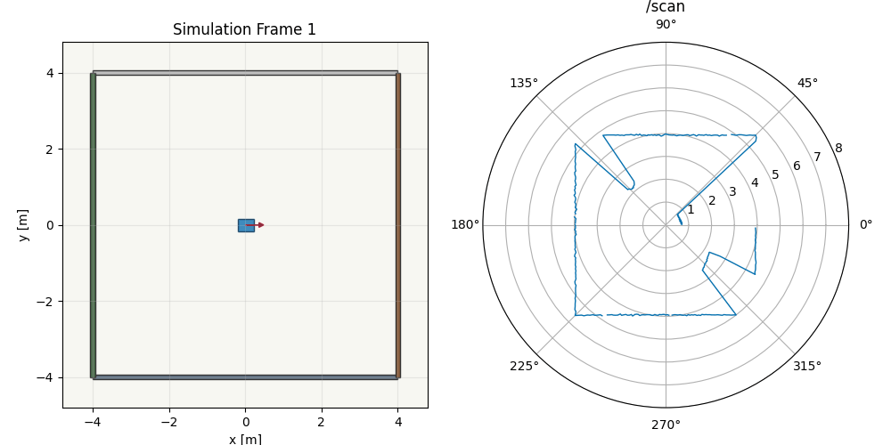
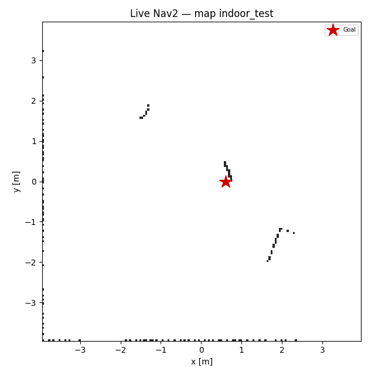

# 2D LiDAR SLAM and Navigation

ROS 2 Humble workspace: Gazebo diff-drive simulation, optional LaserScan noise, `slam_toolbox` mapping, Nav2 on a saved map, wheel / wheel+IMU / wheel+IMU+ICP EKF fusion, and a custom C++ 2D ICP odometry node.

## Demo

Simulation preview (offline render):



Live Nav2 on saved map `slam_navigation/maps/indoor_test.yaml`:

 · [`outputs/nav2_demo.mp4`](outputs/nav2_demo.mp4)

## Custom vs third-party

| Component | Origin |
|-----------|--------|
| Gazebo world, URDF/xacro, scan relay, validation scripts | **This repo** (`robot_bringup`) |
| LaserScan noise node | **This repo** (`noise_injection`) |
| 2D ICP library + node | **This repo** (`icp_odometry`, Eigen/SVD) |
| EKF YAML + launch wiring, fusion modes | **This repo** (uses **ROS `robot_localization`** EKF node) |
| Mapping / Nav2 launch wiring, tuned params | **This repo** (uses **`slam_toolbox`**, **`nav2_bringup`**) |
| Trajectory / Nav2 benchmark scripts | **This repo** (`navigation_evaluation`) |

## Dependencies

```bash
sudo apt install \
  ros-humble-gazebo-ros-pkgs \
  ros-humble-gazebo-plugins \
  ros-humble-robot-state-publisher \
  ros-humble-xacro \
  ros-humble-tf2-ros \
  ros-humble-slam-toolbox \
  ros-humble-nav2-bringup \
  ros-humble-navigation2 \
  ros-humble-robot-localization \
  ros-humble-teleop-twist-keyboard \
  python3-matplotlib
```

## Build

```bash
source /opt/ros/humble/setup.bash
colcon build
source install/setup.bash
colcon test --packages-select icp_odometry
```

## Run simulation

```bash
ros2 launch robot_bringup simulation.launch.py headless:=false
ros2 run robot_bringup validate_simulation.py
```

Ground-truth pose (Gazebo `p3d`): `/ground_truth/odom` · Wheel odometry: `/odom`.

## Mapping (SLAM Toolbox)

```bash
ros2 launch slam_navigation mapping.launch.py headless:=false
ros2 run robot_bringup mapping_explore.py
ros2 run nav2_map_server map_saver_cli -f src/slam_navigation/maps/indoor_test
```

## Navigation (AMCL + Nav2)

```bash
ros2 launch slam_navigation navigation.launch.py headless:=false
ros2 run robot_bringup nav_three_goals.py
```

EKF (disable Gazebo `odom→base_link` TF when EKF runs):

```bash
ros2 launch slam_navigation navigation.launch.py use_ekf:=true publish_odom_tf:=false
ros2 launch robot_bringup ekf.launch.py fusion_mode:=wheel_imu
```

ICP:

```bash
ros2 launch icp_odometry icp_odometry.launch.py
```

## Trajectory evaluation

Ground truth: Gazebo **p3d** on `/ground_truth/odom`. Compare fused or wheel odometry with:

```bash
source scripts/source_ws.sh
ros2 launch robot_bringup simulation.launch.py headless:=true publish_odom_tf:=false
ros2 launch robot_bringup ekf.launch.py fusion_mode:=wheel_imu
ros2 run robot_bringup send_test_velocity.py --ros-args -p duration_sec:=15 -p linear_x:=0.15
ros2 run navigation_evaluation trajectory_evaluator.py --ros-args \
  -p estimate_topic:=/odometry/filtered -p fusion_mode:=wheel_imu -p lidar_mode:=clean \
  -p duration_sec:=20 -p output_csv:=evaluations/results/trajectory_row.csv
```

Batch matrix (9 fusion × lidar cases):

```bash
bash scripts/run_trajectory_matrix.sh
```

## Full evaluation (optional)

```bash
bash scripts/run_full_eval_safe.sh
```

Results are **not** checked into git. Example **local** runs (reproducible with `scripts/run_trajectory_matrix.sh` + EKF):

| fusion | lidar | n | ATE (m) | Notes |
|--------|-------|---|---------|--------|
| wheel | clean | 635 | 0.00025 | `/odom` vs `/ground_truth/odom` |
| wheel_imu | clean | 391 | 0.0040 | `/odometry/filtered` vs GT |

Example **wheel_imu / clean** relative error: ~4 mm over ~2 m straight-line test → **&lt;0.2% path error rate**.

<!-- EVAL_RESULTS_START -->
See table above; update after your own runs from `evaluations/results/trajectory_metrics.csv`.
<!-- EVAL_RESULTS_END -->

## ICP odometry convention

Between consecutive scans, `runIcp(current, previous)` returns `T` mapping current scan coordinates into the previous scan frame. The node integrates **`global_pose = global_pose * T`** in SE(2), sets twist from the message timestamp delta, normalizes yaw, and fills pose/twist covariances from parameters.
